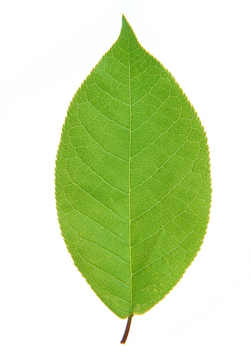
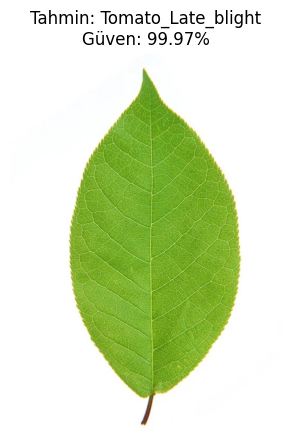
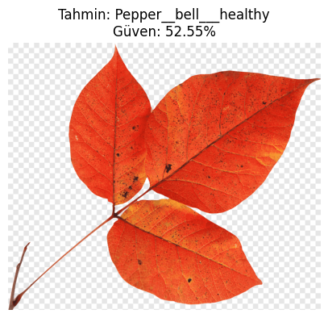
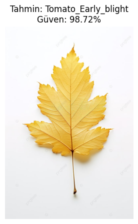
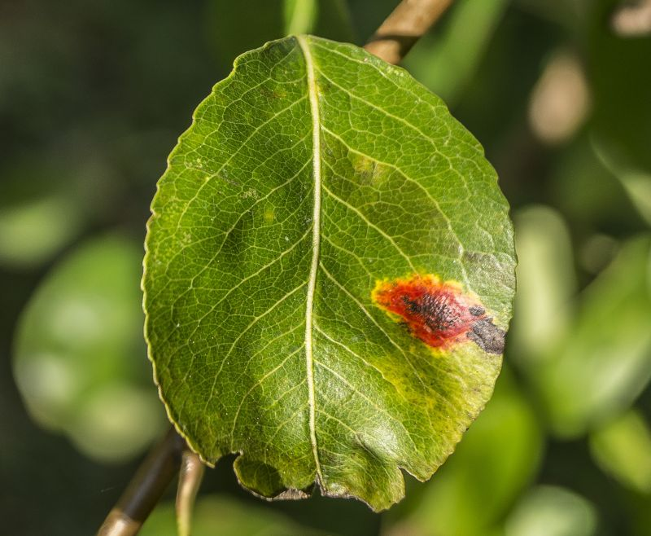
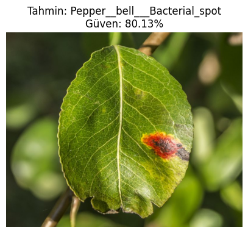

# 🌿 AgroLeafNet — Plant Disease Detection with Deep Learning

[🇹🇷 Türkçe](#-türkçe) | [🇬🇧 English](#-english)

---

# 🇹🇷 Türkçe

## 📌 Proje Hakkında

**AgroLeafNet**, bitki yapraklarının görüntülerini analiz ederek bitki hastalıklarını tespit etmek ve sınıflandırmak amacıyla geliştirilmiş **derin öğrenme tabanlı bir görüntü sınıflandırma projesidir**.

Proje kapsamında yaprak görüntüleri üzerinde görüntü işleme ve derin öğrenme teknikleri uygulanarak bir sınıflandırma modeli eğitilmiştir. Eğitilen model yeni bir yaprak görüntüsünü analiz ederek görüntünün ait olduğu sınıfı tahmin edebilmektedir.

Projenin temel amacı, **yapay zekâ ve bilgisayarlı görü teknolojilerinin tarım alanında kullanılabilirliğini** göstermek ve bitki hastalıklarının görüntüler üzerinden otomatik olarak tespit edilmesine yönelik bir sistem geliştirmektir.

## 🎯 Projenin Amaçları

* Bitki yapraklarındaki hastalık belirtilerini görüntüler üzerinden analiz etmek
* Derin öğrenme tabanlı görüntü sınıflandırma modeli geliştirmek
* CNN tabanlı yöntemlerden yararlanmak
* Görüntü ön işleme ve veri artırma tekniklerini uygulamak
* Modelin eğitim ve doğrulama performansını takip etmek
* Eğitilen modeli kaydederek daha sonra yeniden kullanılabilir hale getirmek
* Yeni yaprak görüntüleri üzerinde otomatik tahmin gerçekleştirmek
* Yapay zekânın tarım teknolojilerindeki potansiyel kullanımını göstermek

## ✨ Proje Özellikleri

* 🌿 Bitki yaprağı görüntülerinin analizi
* 🧠 Derin öğrenme tabanlı sınıflandırma
* 🖼️ Görüntü ön işleme
* 🔄 Veri artırma (Data Augmentation)
* 📊 Eğitim ve doğrulama performansının izlenmesi
* 💾 Eğitilmiş modelin `.keras` formatında kaydedilmesi
* 🔍 Yeni görüntüler üzerinde hastalık tahmini
* 📈 Accuracy ve Loss değerlerinin görselleştirilmesi

## 🧠 Sistem Çalışma Mantığı

```text
Bitki Yaprağı Görüntüsü
          │
          ▼
   Görüntü Ön İşleme
          │
          ▼
     Veri Hazırlama
          │
          ▼
   Derin Öğrenme Modeli
          │
          ▼
     Model Eğitimi
          │
          ▼
 Eğitim / Doğrulama
     Performansı
          │
          ▼
     Eğitilmiş Model
          │
          ▼
 Yeni Görüntü Üzerinde
       Tahmin
          │
          ▼
   Hastalık / Sınıf
        Sonucu
```

Sistem ilk olarak bitki yaprağı görüntülerini modelin işleyebileceği formata dönüştürür. Eğitim sürecinde görüntüler kullanılarak derin öğrenme modeli eğitilir ve doğrulama verileriyle modelin genelleme performansı takip edilir.

Eğitim tamamlandıktan sonra model `.keras` formatında kaydedilir. Kaydedilen model daha sonra yeni bitki yaprağı görüntülerini analiz etmek ve sınıflandırma tahmini üretmek için kullanılabilir.

## 🛠️ Kullanılan Teknolojiler

| Teknoloji              | Kullanım Amacı                            |
| ---------------------- | ----------------------------------------- |
| **Python**             | Ana programlama dili                      |
| **TensorFlow / Keras** | Derin öğrenme modeli geliştirme ve eğitme |
| **CNN**                | Görüntü sınıflandırma                     |
| **Jupyter Notebook**   | Model geliştirme ve deney ortamı          |
| **NumPy**              | Sayısal işlemler                          |
| **Matplotlib**         | Eğitim sonuçlarının görselleştirilmesi    |
| **Image Processing**   | Yaprak görüntülerinin modele hazırlanması |

## 📁 Proje Dosyaları

```text
AgroLeafNet-PlantDiseaseDetection/
│
├── AgroLeafNet_Bitki_Hastalik_Tespiti.ipynb
├── AgroLeafNet_model.keras
│
├── Training vs Validation Loss Training vs Validation Accuracy.png
│
├── örnek1.jpg
├── örnek2.png
├── örnek3.jpg
├── örnek4.jpg
│
├── sonuç1.png
├── sonuç2.png
├── sonuç3.png
├── sonuç4.png
│
└── README.md
```

### Önemli Dosyalar

| Dosya                                                             | Açıklama                                                                 |
| ----------------------------------------------------------------- | ------------------------------------------------------------------------ |
| `AgroLeafNet_Bitki_Hastalik_Tespiti.ipynb`                        | Model geliştirme, eğitim ve test işlemlerinin bulunduğu Jupyter Notebook |
| `AgroLeafNet_model.keras`                                         | Eğitilmiş AgroLeafNet modeli                                             |
| `Training vs Validation Loss Training vs Validation Accuracy.png` | Eğitim ve doğrulama performans grafikleri                                |
| `örnek1-4`                                                        | Model üzerinde test edilen örnek yaprak görüntüleri                      |
| `sonuç1-4`                                                        | Model tahmin sonuçlarının görselleri                                     |

## 🔄 Model Geliştirme Süreci

Model geliştirme süreci temel olarak aşağıdaki aşamalardan oluşmaktadır:

1. Bitki yaprağı görüntülerinin hazırlanması
2. Görüntülerin ön işlenmesi
3. Eğitim ve doğrulama verilerinin oluşturulması
4. Veri artırma tekniklerinin uygulanması
5. Derin öğrenme modelinin oluşturulması
6. Modelin eğitilmesi
7. Eğitim ve doğrulama sonuçlarının değerlendirilmesi
8. Modelin `.keras` formatında kaydedilmesi
9. Yeni yaprak görüntüleri üzerinde tahmin yapılması

## 📊 Model Performansı

Modelin eğitim sürecindeki performansı **Training Accuracy, Validation Accuracy, Training Loss ve Validation Loss** değerleri üzerinden takip edilmiştir.


Bu grafik, modelin eğitim ve doğrulama süreçlerindeki performans değişimini gözlemlemek için kullanılmaktadır.

## 🔍 Örnek Tahmin Sonuçları

### Örnek 1

| Girdi                   | Tahmin Sonucu           |
| ----------------------- | ----------------------- |
|  |  |

### Örnek 2

| Girdi                   | Tahmin Sonucu           |
| ----------------------- | ----------------------- |
|  |  |

### Örnek 3

| Girdi                   | Tahmin Sonucu           |
| ----------------------- | ----------------------- |
|  |  |

### Örnek 4

| Girdi                   | Tahmin Sonucu           |
| ----------------------- | ----------------------- |
|  |  |

## 🚀 Kurulum ve Kullanım

### Repoyu Klonlama

```bash
git clone https://github.com/myusufkocaoglan/AgroLeafNet-PlantDiseaseDetection.git
cd AgroLeafNet-PlantDiseaseDetection
```

### Gerekli Kütüphaneler

Projenin çalıştırılabilmesi için temel olarak aşağıdaki Python kütüphanelerinin kurulu olması gerekir:

```bash
pip install tensorflow numpy matplotlib jupyter
```

### Notebook'u Çalıştırma

```bash
jupyter notebook
```

Ardından:

```text
AgroLeafNet_Bitki_Hastalik_Tespiti.ipynb
```

dosyasını açarak model geliştirme, eğitim ve tahmin adımlarını inceleyebilirsiniz.

## 🌾 Potansiyel Kullanım Alanları

Bu projede kullanılan yaklaşım aşağıdaki alanlara uyarlanabilir:

* Akıllı tarım sistemleri
* Bitki hastalıklarının erken tespiti
* Tarımsal karar destek sistemleri
* Mobil bitki hastalığı tanı uygulamaları
* Görüntü tabanlı tarımsal analiz
* Hassas tarım (Precision Agriculture)
* Yapay zekâ destekli tarım uygulamaları

## 🔮 Gelecekte Yapılabilecek Geliştirmeler

* Gerçek zamanlı kamera desteği
* Mobil uygulama entegrasyonu
* Web tabanlı tahmin arayüzü
* Daha fazla bitki ve hastalık sınıfının eklenmesi
* Modelin farklı saha koşullarında test edilmesi
* TensorFlow Lite ile mobil cihazlara uyarlanması
* IoT tabanlı tarım sistemleriyle entegrasyon

## 👨‍💻 Geliştirici

**Muhammed Yusuf Kocaoğlan**

Computer Engineer

---

# 🇬🇧 English

## 📌 About the Project

**AgroLeafNet** is a **deep learning-based image classification project** developed to detect and classify plant diseases by analyzing images of plant leaves.

The project applies image processing and deep learning techniques to leaf images in order to train a classification model. The trained model can analyze a new leaf image and predict its corresponding class.

The main objective of the project is to demonstrate the **application of artificial intelligence and computer vision technologies in agriculture** and explore automated plant disease detection through image analysis.

## 🎯 Project Objectives

* Analyze visible disease symptoms from plant leaf images
* Develop a deep learning-based image classification model
* Apply CNN-based image classification techniques
* Implement image preprocessing and data augmentation
* Monitor training and validation performance
* Save the trained model for future use
* Perform predictions on previously unseen leaf images
* Demonstrate potential AI applications in agricultural technology

## ✨ Features

* 🌿 Plant leaf image analysis
* 🧠 Deep learning-based classification
* 🖼️ Image preprocessing
* 🔄 Data augmentation
* 📊 Training and validation performance monitoring
* 💾 Model storage in `.keras` format
* 🔍 Disease classification on new images
* 📈 Accuracy and loss visualization

## 🧠 System Workflow

```text
Plant Leaf Image
       │
       ▼
 Image Preprocessing
       │
       ▼
  Data Preparation
       │
       ▼
 Deep Learning Model
       │
       ▼
   Model Training
       │
       ▼
Training / Validation
     Evaluation
       │
       ▼
   Trained Model
       │
       ▼
Prediction on New Image
       │
       ▼
 Disease / Class Result
```

Plant leaf images are first transformed into a format suitable for the deep learning model. During training, the model learns from the prepared image dataset while validation data is used to monitor its generalization performance.

After training, the model is stored in `.keras` format and can later be loaded to classify previously unseen plant leaf images.

## 🛠️ Technologies Used

| Technology             | Purpose                                      |
| ---------------------- | -------------------------------------------- |
| **Python**             | Main programming language                    |
| **TensorFlow / Keras** | Deep learning model development and training |
| **CNN**                | Image classification                         |
| **Jupyter Notebook**   | Development and experimentation environment  |
| **NumPy**              | Numerical operations                         |
| **Matplotlib**         | Training performance visualization           |
| **Image Processing**   | Preparing leaf images for classification     |

## 📁 Project Structure

```text
AgroLeafNet-PlantDiseaseDetection/
│
├── AgroLeafNet_Bitki_Hastalik_Tespiti.ipynb
├── AgroLeafNet_model.keras
│
├── Training vs Validation Loss Training vs Validation Accuracy.png
│
├── örnek1.jpg
├── örnek2.png
├── örnek3.jpg
├── örnek4.jpg
│
├── sonuç1.png
├── sonuç2.png
├── sonuç3.png
├── sonuç4.png
│
└── README.md
```

### Important Files

| File                                                              | Description                                                          |
| ----------------------------------------------------------------- | -------------------------------------------------------------------- |
| `AgroLeafNet_Bitki_Hastalik_Tespiti.ipynb`                        | Jupyter Notebook containing model development, training, and testing |
| `AgroLeafNet_model.keras`                                         | Trained AgroLeafNet model                                            |
| `Training vs Validation Loss Training vs Validation Accuracy.png` | Training and validation performance visualization                    |
| `örnek1-4`                                                        | Sample leaf images used for model testing                            |
| `sonuç1-4`                                                        | Model prediction result images                                       |

## 🔄 Model Development Process

The model development workflow consists of the following main stages:

1. Preparing plant leaf images
2. Image preprocessing
3. Creating training and validation datasets
4. Applying data augmentation
5. Building the deep learning model
6. Training the model
7. Evaluating training and validation results
8. Saving the model in `.keras` format
9. Performing predictions on new leaf images

## 📊 Model Performance

The training process is evaluated using **Training Accuracy, Validation Accuracy, Training Loss, and Validation Loss**.


This visualization helps analyze the model's behavior during the training and validation processes.

## 🔍 Example Predictions

### Example 1

| Input                   | Prediction              |
| ----------------------- | ----------------------- |
|  |  |

### Example 2

| Input                   | Prediction              |
| ----------------------- | ----------------------- |
|  |  |

### Example 3

| Input                   | Prediction              |
| ----------------------- | ----------------------- |
|  |  |

### Example 4

| Input                   | Prediction              |
| ----------------------- | ----------------------- |
|  |  |

## 🚀 Installation and Usage

### Clone the Repository

```bash
git clone https://github.com/myusufkocaoglan/AgroLeafNet-PlantDiseaseDetection.git
cd AgroLeafNet-PlantDiseaseDetection
```

### Install Dependencies

The project primarily requires the following Python libraries:

```bash
pip install tensorflow numpy matplotlib jupyter
```

### Run the Notebook

```bash
jupyter notebook
```

Then open:

```text
AgroLeafNet_Bitki_Hastalik_Tespiti.ipynb
```

to explore the model development, training, evaluation, and prediction workflow.

## 🌾 Potential Applications

The approach demonstrated in this project can be adapted to:

* Smart agriculture systems
* Early plant disease detection
* Agricultural decision support systems
* Mobile plant disease diagnosis applications
* Image-based agricultural analysis
* Precision agriculture
* AI-assisted farming technologies

## 🔮 Future Improvements

* Real-time camera-based detection
* Mobile application integration
* Web-based prediction interface
* Support for additional crops and disease classes
* Evaluation under different real-world field conditions
* TensorFlow Lite deployment for mobile devices
* Integration with IoT-based agricultural systems

## 👨‍💻 Developer

**Muhammed Yusuf Kocaoğlan**

Computer Engineer

---

## 📄 License

This project was developed for educational and academic purposes.
